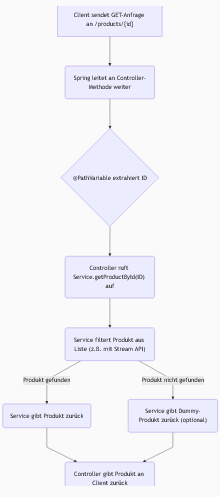
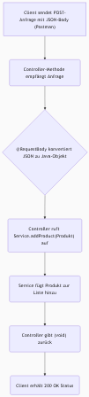

## HTTP-Methoden und REST-APIs
- REST-APIs nutzen das **HTTP-Protokoll**, das spezifische Methoden für verschiedene Operationen bereitstellt.
- Die wichtigsten HTTP-Methoden sind:
    -   **GET**: Zum Abrufen von Daten vom Server.
    -   **POST**: Zum Speichern von Daten auf dem Server.
    -   **PUT**: Zum Aktualisieren vorhandener Daten.
    -   **DELETE**: Zum Löschen von Daten.
- Diese Methoden korrespondieren mit den **CRUD-Operationen**:
    -   **Create** (Erstellen) wird mit **POST** durchgeführt.
    -   **Read** (Lesen) wird mit **GET** durchgeführt.
    -   **Update** (Aktualisieren) wird mit **PUT** durchgeführt.
    -   **Delete** (Löschen) wird mit **DELETE** durchgeführt.
- Standardmäßig sendet ein Webbrowser beim Aufruf einer URL eine GET-Anfrage.

## Postman für API-Tests
- Da Webbrowser die HTTP-Methoden (außer GET) nicht direkt über die Adressleiste ändern können, sind spezielle **API-Tools** wie **Postman** erforderlich, um POST-, PUT- oder DELETE-Anfragen zu senden.
- Postman ist ein kostenloses Tool, das über seine offizielle Website heruntergeladen werden kann.
- Eine typische URL für API-Anfragen ist `localhost:8090/products`.
- Nach dem Senden einer Anfrage in Postman erhält man eine Antwort, die Daten und einen **HTTP-Statuscode** enthält.
- Wichtige Statuscodes umfassen:
    -   **200er-Serie**: Zeigt Erfolg an (z.B. 200 OK).
    -   **400er-Serie**: Zeigt Client-Fehler an (z.B. 404 Not Found für nicht gefundene Ressourcen, 400 Bad Request).
    -   **500er-Serie**: Zeigt Server-Fehler an.
- Die Antwortdaten werden standardmäßig im **JSON-Format** gesendet, können aber auch als Text angezeigt werden.

## Abrufen von Daten (GET-Anfragen)
- Um alle Produkte abzurufen, wird eine GET-Anfrage an `/products` gesendet.
- Um ein **einzelnes Produkt nach ID** abzurufen (z.B. `/products/102`), muss eine spezifische Methode im Controller implementiert werden, die einen einzelnen `Product` zurückgibt.
- Diese Methode delegiert die Logik an eine `getProductById`-Methode im Service-Layer.
- Die Service-Methode kann die Daten aus einer Liste filtern, z.B. mithilfe der Java Stream API (`products.stream().filter(...).findFirst().get()`).
- Um dynamische IDs in der URL zu unterstützen (anstatt statische Werte wie `103` zu verwenden), wird die Syntax mit geschweiften Klammern (`{prodId}`) in der Request-Mapping-URL verwendet.
- Die Annotation **`@PathVariable`** wird verwendet, um den dynamischen Wert aus der URL (z.B. `103`) einem Methodenparameter (z.B. `prodId`) zuzuordnen.
- Eine Möglichkeit, nicht gefundene Elemente zu behandeln, ist die Rückgabe eines Dummy-Produkts (z.B. `100, "no item", 0`) mithilfe von `findFirst().orElse(...)` im Service-Layer, obwohl dies nicht die optimale Lösung ist.

Hier ist ein Flussdiagramm, das den Prozess des Abrufens eines Produkts nach ID visualisiert:

## Senden und Speichern von Daten (POST-Anfragen)
- Um Daten zu speichern, wird eine **`addProduct`**-Methode im Service-Layer erstellt, die ein `Product`-Objekt akzeptiert und es einer Liste hinzufügt.
- Im Controller wird eine `void`-Methode `addProduct` erstellt, die das `Product`-Objekt vom Client empfängt.
- Die **Jackson-Bibliothek**, die standardmäßig in Spring Web enthalten ist, ist für die automatische Konvertierung von JSON-Daten vom Client in Java-Objekte und umgekehrt verantwortlich.
- Um GET- und POST-Anfragen zu unterscheiden, wenn sie dieselbe URL verwenden (z.B. `/products`), werden spezialisierte Annotationen verwendet: **`@GetMapping`** für GET-Anfragen und **`@PostMapping`** für POST-Anfragen.
- Für POST-Anfragen müssen die Daten im **Request-Body** gesendet werden. In Postman wählt man dazu "raw" und das "JSON"-Format und gibt die JSON-Daten ein.
- Ein häufiges Problem beim Hinzufügen von Daten ist, dass die verwendete Liste **unveränderlich** sein kann (z.B. `Arrays.asList`). Die Lösung ist die Verwendung einer **veränderlichen Liste** wie `new ArrayList()`.
- Ein weiteres Problem ist, dass die vom Client gesendeten Daten nicht auf dem Server empfangen werden. Dies wird durch die Annotation **`@RequestBody`** am Methodenparameter behoben, die sicherstellt, dass der eingehende JSON-Request-Body korrekt einem Java-Objekt zugeordnet wird.
- Nach erfolgreicher Implementierung einer POST-Anfrage kann der Statuscode **200 OK** empfangen werden, auch wenn die Methode `void` zurückgibt. Die Verifizierung der Datenaufnahme erfolgt durch eine nachfolgende GET-Anfrage.

Hier ist ein Flussdiagramm, das den Prozess des Hinzufügens eines Produkts visualisiert:

## Zusammenfassung und Ausblick
- Es wurde erfolgreich gezeigt, wie man GET-Anfragen (zum Abrufen aller Produkte und einzelner Produkte nach ID) und POST-Anfragen (zum Hinzufügen von Produkten) implementiert und testet.
- Die in diesem Beispiel verwendeten Daten werden in einer Liste gespeichert und sind **nicht persistent**, d.h., sie gehen beim Neustart der Anwendung verloren.
- Die nächsten Schritte umfassen die Implementierung der **PUT- und DELETE-Methoden**.