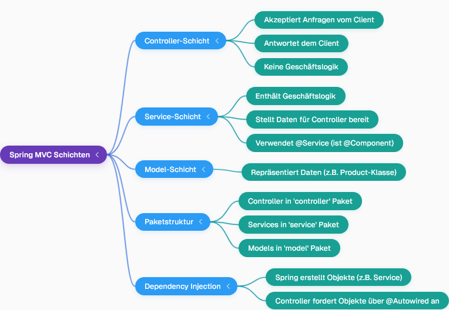

## Grundlagen der Web-Anwendung
- In Spring Boot Webprojekten werden Anfragen für verschiedene Seiten wie die Homepage, die "About"-Seite und die Login-Seite gemappt.
- Der `@RestController` gibt Daten (Text) zurück, während das Entfernen von `Rest` dazu führt, dass der Spring Framework einen Seitennamen sucht und eine HTML-Seite zurückgeben würde.
- Das Ziel ist es, Daten an den Client zu senden, nicht die UI-Komponente.

## Daten als Objekte
- Anwendungen geben oft Daten für **Entitäten** (z.B. Produkte, Flüge) zurück, die mehrere Details wie ID, Name und Preis enthalten.
- In Java werden diese Entitäten als **Objekte** dargestellt.
- Für die Kommunikation mit Client-Anwendungen (z.B. React, mobile Apps) sollten Daten im **JSON**-Format (oder XML) gesendet werden, da dies die Verarbeitung auf Client-Seite erleichtert.
- Ein `ProductController` wird erstellt, um Produktdaten zurückzugeben, wobei der Rückgabetyp von `String` auf Objekte geändert wird.
- Eine `Product`-Klasse wird definiert, um Produktdetails wie `prodId`, `prodName` und `price` zu repräsentieren.
- Die **Lombok**-Bibliothek wird verwendet, um Boilerplate-Code wie Getter, Setter und Konstruktoren automatisch über Annotationen wie `@Data` und `@AllArgsConstructor` zu generieren. Die Lombok-Abhängigkeit wird über die `pom.xml`-Datei hinzugefügt.

## MVC-Schichten
- Eine Anwendung sollte in verschiedene Schichten unterteilt sein, um eine saubere Architektur zu gewährleisten:

- Die `ProductService`-Klasse enthält die Logik zur Rückgabe einer Liste von Produkten, wobei vorübergehend Dummy-Daten verwendet werden, da keine Datenbank integriert ist.
- Der Controller sollte Service-Objekte nicht manuell instanziieren; stattdessen sollte Spring diese Objekte über **Dependency Injection** (mittels `@Autowired`) bereitstellen, da die Service-Klasse mit `@Service` (welches intern ein `@Component` ist) annotiert ist.
- Die `@RequestMapping("/products")`-Annotation auf der Methode im `ProductController` ordnet die URL `/products` dieser Methode zu.

## Debugging & Testen
- Häufige Probleme können belegte Portnummern sein (z.B. 8080, 8081, 8086, 8090), die eine Änderung der Portkonfiguration erfordern.
- Probleme mit der Lombok-Bibliothek können auftreten, die manchmal einen Neustart der IDE oder die manuelle Generierung von Gettern und Settern erfordern.
- Ein Neustart des Systems kann oft unerklärliche Fehler beheben.
- APIs können im Browser (z.B. `localhost:8090/products`) oder mit Tools wie **Postman** getestet werden, um die zurückgegebenen JSON-Daten zu überprüfen.