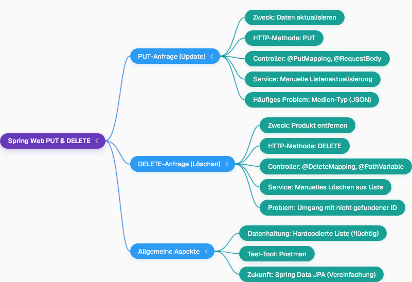

## Implementierung von PUT- und DELETE-Operationen in Spring Web
- Bisher wurden GET-Anfragen zum Abrufen von Produkten und POST-Anfragen zum Hinzufügen neuer Produkte behandelt.
- Die Anwendung läuft auf Port 8090, und die Daten werden in einer hartcodierten Liste gespeichert, was bedeutet, dass sie bei jedem Neustart der Anwendung verloren gehen.
- Eine POST-Anfrage kann erfolgreich ein neues Produkt hinzufügen, wodurch die Anzahl der Datensätze erhöht wird.

### PUT-Anfrage zur Produktaktualisierung
- Um ein Produkt zu aktualisieren, muss der Anfragetyp in Postman auf **PUT** geändert werden.
- Im Controller wird eine Methode mit der Annotation `@PutMapping` erstellt, die Produktdaten über `@RequestBody` empfängt.
- Der Controller delegiert die Aktualisierungsaufgabe an eine `updateProduct`-Methode im Service.
- Die Service-Methode muss das Produkt manuell in der Liste finden (durch Iteration und Abgleich der Produkt-ID) und es dann mit dem neuen Objekt ersetzen.
- Ein häufiges Problem beim Senden von PUT-Anfragen ist ein `Unsupported Media Type`-Fehler, der auftritt, wenn der Body als Text statt als JSON gesendet wird.

Hier ist eine Mindmap, die die Komponenten von PUT- und DELETE-Anfragen in Spring Web darstellt:

### DELETE-Anfrage zum Produktlöschen
- Für das Löschen eines Produkts wird eine DELETE-Anfrage gesendet, wobei die Produkt-ID in der URL übergeben wird (z.B. `products/102`).
- Im Controller wird eine Methode mit der Annotation `@DeleteMapping` erstellt, die die Produkt-ID über `@PathVariable` empfängt.
- Der Controller ruft eine `deleteProduct`-Methode im Service auf, die die übergebene Produkt-ID akzeptiert.
- Die Service-Methode muss die Liste durchlaufen, um das Produkt mit der passenden ID zu finden und es dann aus der Liste zu entfernen.
- Eine Schwachstelle dieser manuellen Implementierung ist, dass sie das erste Element löschen könnte, wenn die angegebene ID nicht gefunden wird, anstatt eine Fehlermeldung zurückzugeben.
- Nach dem erfolgreichen Löschen zeigt eine erneute GET-Anfrage, dass das Produkt entfernt wurde.

Hier ist ein Flussdiagramm, das den Anfragefluss für PUT- und DELETE-Operationen visualisiert:

### Fazit zu CRUD-Operationen
- Mit der Implementierung von PUT und DELETE sind die grundlegenden **CRUD**-Operationen (Create, Read, Update, Delete) abgeschlossen.
- Die manuelle Verwaltung von Listen im Service ist komplex; zukünftige Module wie **Spring Data JPA** werden diese Operationen erheblich vereinfachen.