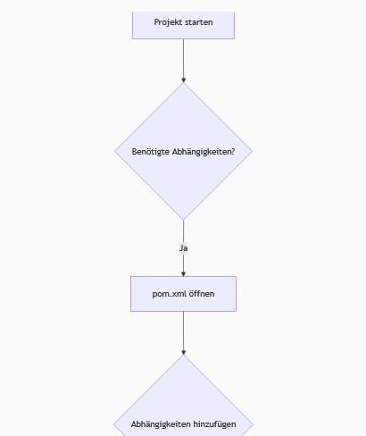
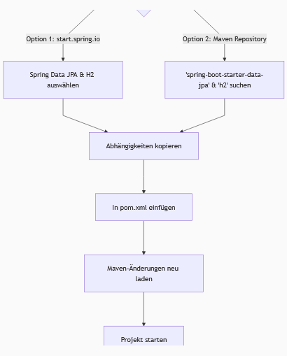

## Implementierung von Spring Data JPA und H2
- Das Hauptziel ist es, Daten in einer Datenbank zu speichern und abzurufen, anstatt hartkodierte Werte zu verwenden.
- Der Request-Fluss geht vom Controller zum Service und dann zur Datenbank.

## Benötigte Komponenten und Abhängigkeiten
- Für die Datenbankintegration werden eine Datenbank (hier **H2**), ein **H2-Treiber** (Konnektor) und die **Spring Data JPA**-Fähigkeit benötigt.
- Abhängigkeiten werden über die `pom.xml`-Datei hinzugefügt.
- Standardmäßig enthält ein Spring Boot-Projekt nur `spring-boot-starter`, nicht `spring-boot-starter-web`.
- Um Spring Data JPA und H2 hinzuzufügen, kann man `start.spring.io` verwenden und die Abhängigkeiten **Spring Data JPA** und **H2 Database** auswählen.
- Alternativ können die Abhängigkeiten auch manuell aus dem Maven-Repository gesucht und in die `pom.xml` eingefügt werden.
- Es ist wichtig, `spring-boot-starter-data-jpa` zu wählen, da es sich um ein Spring Boot-Projekt handelt, und nicht nur `spring-data-jpa`.
- Die Version der Abhängigkeiten wird oft vom übergeordneten Spring Boot-Projekt geerbt, sodass die Versionsnummer in der einzelnen Abhängigkeitsdeklaration weggelassen werden kann.
- Die `h2`-Abhängigkeit sollte den `runtime`-Scope haben, um sicherzustellen, dass sie zur Laufzeit verfügbar ist.

Hier ist ein Flussdiagramm, das den Prozess des Hinzufügens von Abhängigkeiten veranschaulicht:

## H2-Datenbankkonfiguration
- Nach dem Hinzufügen der H2-Treiberabhängigkeit muss die Datenbank-URL in der `application.properties`-Datei konfiguriert werden, da sonst ein Fehler auftritt.
- Die URL wird mit `spring.datasource.url` festgelegt, z.B. `jdbc:h2:mem:testdb` für eine In-Memory-Datenbank.
- Der Treiberklassenname muss ebenfalls mit `spring.datasource.driver-class-name` angegeben werden, z.B. `org.h2.Driver`.
- Standardmäßig sind der Benutzername `sa` und das Passwort leer.

## Zugriff auf die H2-Konsole
- Nach erfolgreichem Start der Anwendung ist die H2-Datenbank bereit.
- Die H2-Konsole kann über die URL `http://localhost:8090/h2-console` (oder den konfigurierten Port) im Browser aufgerufen werden.
- Auf der Konsole können der Treibername, die URL (z.B. `jdbc:h2:mem:telescope`), der Benutzername (`sa`) und das Passwort (leer) überprüft und eine Verbindung hergestellt werden.