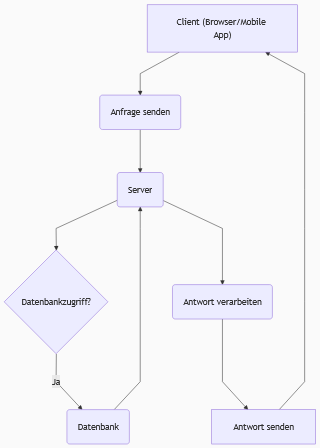
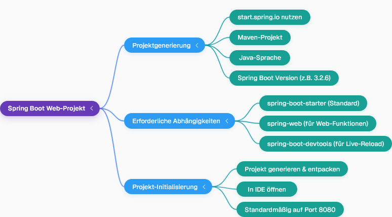

## Web-Anwendungsarchitektur
- Web-Projekte bestehen aus einem **Client**, einem **Server** mit verschiedenen Schichten und einer **Datenbank**.
- Der Client ist der Benutzer der Anwendung, der die Website im Browser öffnet oder eine mobile Anwendung nutzt.
- Der Server empfängt Anfragen vom Client, verarbeitet sie und kann Daten aus der Datenbank abrufen oder dort speichern.
- Mobile Anwendungen können ebenfalls Clients sein, die Anfragen senden und Antworten erhalten.

Hier ist ein Flussdiagramm, das die Web-Anwendungsarchitektur visualisiert:

  
  

---
## Entwicklung der Web-Anwendungsarchitektur
- Früher sendete der Server sowohl das **Layout** (HTML, CSS) als auch die **Daten** an den Client.
- Heutzutage wird die **Frontend-Anwendung** (z.B. mit React oder AngularJS) separat entwickelt und enthält das Layout.
- Der Server ist dann nur noch für das Senden der **Daten** zuständig, oft im Format **JSON** (JavaScript Object Notation) oder XML.
- JSON ist ein sehr beliebtes und einfach zu verstehendes Datenformat für die Übertragung vom Server zum Client.

| Merkmal           | Frühere Web-Anwendungen                               | Moderne Web-Anwendungen                               |
|:---------------- |:---------------------------------------------------- |:---------------------------------------------------- |
| **Server-Aufgabe** | Sendet Layout (HTML, CSS) und Daten                   | Sendet nur Daten                                      |
| **Client-Aufgabe** | Empfängt und rendert vollständige Seiten              | Empfängt Daten, rendert Layout mit Frontend-Framework |
| **Frontend-Technologien** | Server-generiertes HTML/CSS                   | React, AngularJS, etc.                                |
| **Datenformat**   | Integriert in HTML                                    | JSON, XML                                             |
    

---
## Einrichten eines Spring Boot Web-Projekts
- Um eine Web-Anwendung mit Spring Boot zu erstellen, muss das Projekt die **Web-Funktion** enthalten.
- Standard-Spring Boot-Projekte haben diese Funktion nicht standardmäßig; die **`spring-web`**-Abhängigkeit muss hinzugefügt werden.
- Ein neues Web-Projekt kann über **`start.spring.io`** generiert werden, indem man die erforderlichen Abhängigkeiten auswählt.
- Neben `spring-web` ist es nützlich, **`spring-boot-devtools`** hinzuzufügen, um Live-Reload und schnellere Anwendungsneustarts zu ermöglichen.
- Nach dem Generieren und Entpacken kann das Projekt direkt in einer IDE geöffnet und ausgeführt werden, ohne dass manuell ein Server wie Tomcat konfiguriert werden muss.
- Ein gestarteter Spring Boot Web-Server läuft standardmäßig auf **Port 8080**.

Hier ist eine Mind Map, die den Prozess der Spring Boot Web-Projekt-Einrichtung darstellt:

---
## Bearbeiten von Web-Anfragen mit Controllern
- Um Anfragen zu bearbeiten, benötigt der Server eine Klasse, die als **Controller** fungiert.
- Eine Methode in dieser Controller-Klasse kann eine Anfrage bearbeiten und eine Antwort zurückgeben.
- Die Annotation **`@Controller`** kennzeichnet eine Klasse als Spring-Controller, der Anfragen verarbeiten kann.
- Die Annotation **`@RequestMapping`** wird verwendet, um eine Methode einer bestimmten URL-Anfrage zuzuordnen (z.B. `/` für die Startseite oder `/about` für die Über-uns-Seite).
- Standardmäßig versucht `@Controller`, eine Seite (Layout) zurückzugeben, die dem Rückgabewert der Methode entspricht.
- Um stattdessen nur **Daten** (z.B. Text oder JSON) zurückzugeben und nicht nach einer Seite zu suchen, kann man:
    - Die Annotation **`@ResponseBody`** zur Methode hinzufügen.
    - Oder die Controller-Klasse mit **`@RestController`** annotieren, was `@Controller` und `@ResponseBody` kombiniert und für REST-APIs verwendet wird.
- Es können mehrere Controller-Klassen existieren, um verschiedene Anfragen zu bearbeiten (z.B. ein `HomeController` und ein `LoginController`).

---
## Die Rolle des Front Controllers
- Spring MVC (Model-View-Controller) verwendet einen **Front Controller**, der alle eingehenden Client-Anfragen zuerst empfängt.
- Dieser Front Controller wird automatisch von Spring erstellt und ist nicht etwas, das der Entwickler manuell erstellen muss.
- Die Aufgabe des Front Controllers ist es, alle `@RequestMapping`-Annotationen der verschiedenen Controller zu kennen und die Anfrage an den entsprechenden Controller weiterzuleiten.
- Dies ermöglicht es, dass mehrere Controller existieren und Anfragen korrekt an den zuständigen Controller geleitet werden, ohne dass es zu Verwirrung kommt.