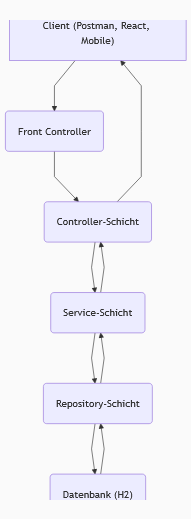
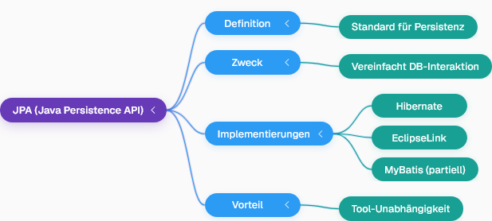

## 1. Einführung in Spring Data JPA
- Spring ist ein großes Projekt mit vielen Modulen, darunter **Spring Data**, das sich mit Daten befasst.
- Um speziell JPA zu nutzen, wird das Modul **Spring Data JPA** verwendet.
- Spring Data JPA vereinfacht das Speichern von Daten in der Datenbank erheblich.
- Es ermöglicht das Speichern von Daten aus der Service-Schicht in einer Datenbank.
- Für Lernzwecke wird die **H2-Datenbank** verwendet, da sie einfach einzurichten und zu nutzen ist.

## 2. Anwendungsarchitektur und Datenfluss
- Die Anwendung hat eine allgemeine Architektur, die einen Client (z.B. Postman, React-Anwendung oder mobile App) umfasst, der mit dem Server interagiert.
- Anfragen vom Client gehen an den **Front Controller** und dann an die **Controller-Schicht** (z.B. `ProductController`).
- Logische Arbeiten und Datenverarbeitung werden von der **Service-Schicht** übernommen.
- Die **Repository-Schicht** ist für die Verbindung mit der Datenbank zuständig.
- Aktuell sind Daten in der Service-Schicht hartkodiert, sollen aber in einer Datenbank gespeichert werden.

Hier ist ein Flussdiagramm, das den Datenfluss in der Anwendung visualisiert:

---
## 3. Evolution der Datenbankinteraktion
- Früher wurde **JDBC (Java Database Connectivity)** verwendet, um Java-Code mit Datenbanken zu verbinden.
- JDBC erforderte sieben Schritte, darunter das Laden von Treibern, das Herstellen einer Verbindung, das Erstellen und Ausführen von SQL-Abfragen und das Verarbeiten von Ergebnissen.
- **Spring JDBC** vereinfachte diesen Prozess durch Reduzierung der Codezeilen und Standardisierung, oft unter Verwendung eines JDBC-Templates.
- Für CRUD-Operationen (Create, Read, Update, Delete) wurde eine noch einfachere Methode gesucht.

## 4. Objekt-Relationales Mapping (ORM)
- **ORM** steht für **Object Relational Mapping** und dient der Abbildung von Java-Objekten auf relationale Datenbanken.
- In Java ist alles ein Objekt, das aus einer Klasse erstellt wird und Daten (Attribute) sowie Verhalten (Methoden) besitzt.
- Beispiel: Ein Produktobjekt hat Daten wie Produkt-ID, Produktname und Preis.
- In der Datenbankwelt gibt es Tabellen mit Namen, Spalten und Zeilen.
- ORM-Tools übersetzen Objekt-Daten in SQL-Abfragen (z.B. `INSERT` für eine neue Zeile) und speichern sie in der Datenbank, ohne dass der Entwickler SQL schreiben muss.
- Das ORM-Tool ist auch dafür verantwortlich, Tabellennamen aus Klassennamen, Spaltennamen aus Variablen und Zeilen aus Objekten abzuleiten.
- Bekannte ORM-Tools sind **Hibernate** (sehr populär), EclipseLink und MyBatis (nicht vollständig ORM).

## 5. JPA als Standard
- **JPA (Java Persistence API)** ist ein Standard, den die meisten ORM-Tools implementieren.
- Hibernate implementiert die JPA-Standards.
- Der Vorteil von JPA ist, dass man bei einem Wechsel des ORM-Tools (z.B. von Hibernate zu EclipseLink) weniger Codeänderungen vornehmen muss, da alle den gleichen Standard befolgen.

Hier ist eine Mindmap, die die Beziehung zwischen JPA und ORM-Tools darstellt:

